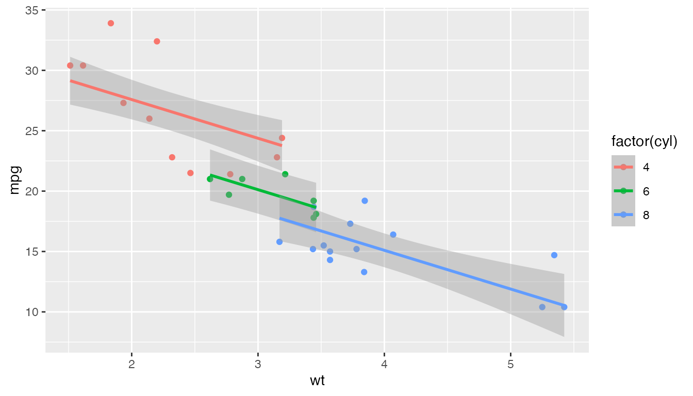
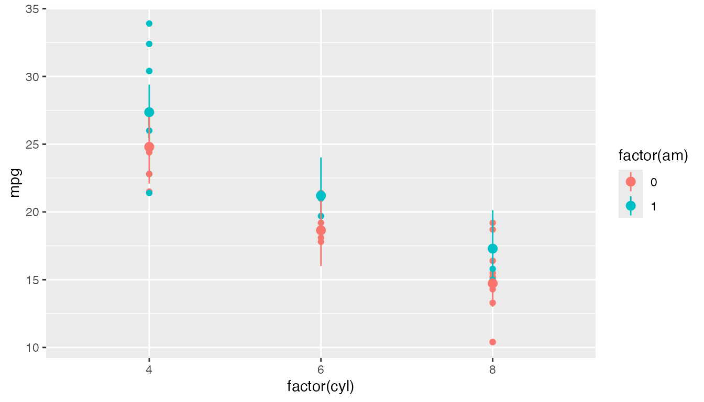

# Using honestlm

`honestlm` keeps familiar linear model workflows, but adds guardrails
around common interpretation traps.

``` r

library(honestlm)
#> honestlm: use honest_lm() for guarded linear model summaries, or as_honest_lm(lm(...)) for existing lm objects.
```

## Summaries

[`honest_lm()`](https://yanivjb.github.io/honestlm/reference/honest_lm.md)
fits a regular [`lm()`](https://rdrr.io/r/stats/lm.html) object with an
extra class. The estimates are ordinary linear-model estimates, but the
printed summary treats coefficient p-values cautiously.

``` r

fit <- honest_lm(mpg ~ wt + factor(cyl), data = mtcars)
summary(fit)
#> 
#> Call:
#> lm(formula = mpg ~ wt + factor(cyl), data = mtcars)
#> 
#> Residuals:
#>     Min      1Q  Median      3Q     Max 
#> -4.5890 -1.2357 -0.5159  1.3845  5.7915 
#> 
#> Coefficients:
#>              Estimate Std. Error t value Pr(>|t|)    
#> (Intercept)   33.9908     1.8878  18.006       NA    
#> wt            -3.2056     0.7539  -4.252 0.000213 ***
#> factor(cyl)6  -4.2556     1.3861  -3.070       NA    
#> factor(cyl)8  -6.0709     1.6523  -3.674       NA    
#> ---
#> Signif. codes:  0 '***' 0.001 '**' 0.01 '*' 0.05 '.' 0.1 ' ' 1
#> 
#> Categorical predictors:
#>   factor(cyl): 3 levels; reference level = 4
#> 
#> Notes:
#>   * Intercept p-values are hidden because they usually test whether the expected response is zero at the reference condition. Use intercept_p_value = TRUE if you really want them.
#>   * When present, p-values are shown for continuous predictors and two-level categorical predictors.
#>   * P-values for multi-level categorical coefficient rows are hidden by default because those rows compare levels to a reference level, not whether the overall predictor matters.
#>   * For post-hoc comparisons among factor levels, consider estimated marginal means, e.g. emmeans::emmeans() and pairs(). See https://rvlenth.github.io/emmeans/.
#> 
#> Residual standard error: 2.557 on 28 degrees of freedom
#> Multiple R-squared:  0.8374, Adjusted R-squared:  0.82
#> F-statistic: 48.08 on 3 and 28 DF  (model-level p-value hidden)
```

By default, [`summary()`](https://rdrr.io/r/base/summary.html) shows
p-values for continuous predictors and two-level categorical predictors,
but prints `NA` for intercept p-values and multi-level categorical
contrast rows. Those multi-level rows are comparisons to a reference
level, not separate tests of whether each category, or the whole
predictor, matters. For post-hoc comparisons among levels, estimated
marginal means are usually a better tool.

## Sequential sums of squares

Base [`anova()`](https://rdrr.io/r/stats/anova.html) for a single linear
model with more than one predictor reports sequential Type I sums of
squares. `honestlm` stops by default because those tables depend on the
order of terms in the formula. For term-level tests, use
`car::Anova(model, type = 2)` or use Type III sums of squares with care.

``` r

anova(fit)
#> Error:
#> ! `anova()` for a single linear model with more than one predictor reports sequential Type I sums of squares. honestlm stops here because changing the order of terms can change the table. Use `car::Anova(model, type = 2)` for term-level tests, or type = 3 with care. If you really want Type I sums of squares, call `anova(model, beg = TRUE)`.
```

If you really want the Type I table, you can ask for it explicitly.

``` r

anova(fit, beg = TRUE)
#> Analysis of Variance Table
#> 
#> Response: mpg
#>             Df Sum Sq Mean Sq  F value    Pr(>F)    
#> wt           1 847.73  847.73 129.6650 5.079e-12 ***
#> factor(cyl)  2  95.26   47.63   7.2856  0.002835 ** 
#> Residuals   28 183.06    6.54                       
#> ---
#> Signif. codes:  0 '***' 0.001 '**' 0.01 '*' 0.05 '.' 0.1 ' ' 1
#> Warning: `anova()` for linear models reports sequential Type I sums of squares.
#> Those depend on the order of terms in the formula and are usually not the test
#> you want for models with multiple predictors. Use `car::Anova()` for Type II or
#> Type III sums of squares.
```

## Broom output

If `broom` is installed,
[`tidy()`](https://generics.r-lib.org/reference/tidy.html) removes
`p.value` by default and adds a `contrast_note` column for factor
contrast rows.

``` r

broom::tidy(fit)
#> # A tibble: 4 × 6
#>   term         estimate std.error statistic   p.value contrast_note             
#>   <chr>           <dbl>     <dbl>     <dbl>     <dbl> <chr>                     
#> 1 (Intercept)     34.0      1.89      18.0  NA        NA                        
#> 2 wt              -3.21     0.754     -4.25  0.000213 NA                        
#> 3 factor(cyl)6    -4.26     1.39      -3.07 NA        comparison to reference l…
#> 4 factor(cyl)8    -6.07     1.65      -3.67 NA        comparison to reference l…
```

## Model-aware plots

[`geom_lm_smooth()`](https://yanivjb.github.io/honestlm/reference/geom_lm_smooth.md)
and
[`stat_lm_means()`](https://yanivjb.github.io/honestlm/reference/stat_lm_means.md)
are designed to make plots match the linear model structure being
taught.

``` r

library(ggplot2)

ggplot(mtcars, aes(wt, mpg, colour = factor(cyl))) +
  geom_point() +
  geom_lm_smooth(interaction = FALSE)
```



``` r


ggplot(mtcars, aes(factor(cyl), mpg, colour = factor(am))) +
  geom_point() +
  stat_lm_means(interaction = FALSE)
```



Set `interaction = TRUE` when you want separate slopes or full cell
means.
